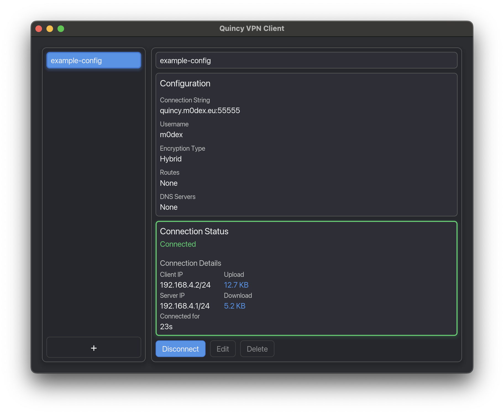

# Quincy
[](https://crates.io/crates/quincy)
[](https://hub.docker.com/r/m0dex/quincy)
[](https://docs.rs/quincy/)
[](https://github.com/M0dEx/quincy/actions?query=workflow%3ACI)
[](https://codecov.io/github/quincy-rs/quincy)
[](LICENCE)
[](https://matrix.to/#/#quincy:matrix.org)

Quincy is a VPN client and server implementation using the [QUIC](https://en.wikipedia.org/wiki/QUIC) protocol with support for pre-quantum, hybrid and post-quantum cryptography.




## Table of contents
- [Supported platforms](#supported-platforms)
- [Installation](#installation)
  - [Cargo](#cargo)
  - [Docker](#docker)
  - [Installers](#installers)
- [Building from sources](#building-from-sources)
  - [Requirements](#requirements)
  - [Build features](#build-features)
- [Usage](#usage)
  - [Client (CLI)](#client-cli)
  - [Client (GUI)](#client-gui)
  - [Server](#server)
  - [Users](#users)
- [Architecture](#architecture)
- [Protocol modes](#protocol-modes)
  - [TLS](#tls)
  - [Noise](#noise)
- [Certificate management](#certificate-management)
  - [Server certificate](#server-certificate)
  - [Client certificate](#client-certificate)

## Supported platforms
- [X] Windows (x86_64), using [Wintun](https://www.wintun.net/)
- [X] Linux (x86_64, aarch64)
- [X] FreeBSD (x86_64, aarch64)
- [X] MacOS (aarch64)

## Installation
Binaries and installers are available for Windows, Linux (x86_64) and macOS (aarch64) for every official release.

### Cargo
Using cargo, installation of any published version can be done with a simple command:
```bash
# CLI client binary
cargo install --locked quincy-client

# CLI server binary
cargo install --locked quincy-server

# Identity management utility
cargo install --locked quincy-identity

# Client GUI binaries
cargo install --locked quincy-gui
```

### Docker
Docker images are available on [Docker Hub](https://hub.docker.com/r/m0dex/quincy) in different flavours:
- `m0dex/quincy:latest`: The latest version of Quincy
- `m0dex/quincy:<version>`: A specific version of Quincy

**Note: it is not possible to use the `dns_servers` configuration option due to how Docker networking works**

To run the client/server, you need to add a volume with the configuration files and add needed capabilities:
```bash
docker run
  --rm # remove the container after it stops
  --cap-add=NET_ADMIN # needed for creating the TUN interface
  --device=/dev/net/tun # needed for creating the TUN interface
  -p "55555:55555" # server port-forwarding
  -v <configuration directory>:/etc/quincy # directory with the configuration files
  m0dex/quincy:latest # or any of the other tags
  quincy-server --config-path /etc/quincy/server.toml
```

### Installers
Platform-specific installers for the GUI client are available for download from the [GitHub releases](https://github.com/quincy-rs/quincy/releases):
- **Windows**: NSIS installer (`.exe`)
- **macOS**: DMG disk image (`.dmg`)
- **Linux**: Debian package (`.deb`) and AppImage (`.AppImage`)

**Note for macOS users**: After installing, you may need to remove the quarantine attribute before the app can be launched:
```bash
xattr -d com.apple.quarantine /Applications/Quincy.app
```

## Building from sources
As Quincy does not rely upon any non-Rust libraries, the build process is incredibly simple:
```bash
cargo build
```
If you additionally want to build Quincy in release mode with optimizations, add the `--release` switch:
```bash
cargo build --release
```
The resulting binaries can be found in the `target/debug` and `target/release` directories.

### Requirements
A C compiler (Clang or GCC) is required for building due to depending on the `aws-lc-rs` cryptography module.

For more information, see [aws-lc-rs build instructions](https://github.com/aws/aws-lc-rs/blob/main/aws-lc-rs/README.md#Build).

### Build features
- `jemalloc`: Uses the jemalloc memory allocator on UNIX systems for improved performance [default: **enabled**]
- `offload`: Enables GSO/GRO offload optimization for TUN interfaces on Linux [default: **enabled**]

## Usage
Quincy provides a couple of binaries based on their intended use:
- `quincy-client`: The VPN client CLI
- `quincy-server`: The VPN server CLI
- `quincy-identity`: A utility for generating keys and certificates for both TLS and Noise modes
- `quincy-client-gui`: The VPN client GUI
- `quincy-client-daemon`: The VPN client daemon (background privileged service)

### Client (CLI)
The Quincy client requires a separate configuration file, an example of which can be found in [`examples/client.toml`](examples/client.toml).
The documentation for the client configuration file fields can be found [here](https://docs.rs/quincy/latest/quincy/config/struct.ClientConfig.html).

With the configuration file in place, the client can be started using the following command:
```bash
quincy-client --config-path examples/client.toml
```

Routes are set by default to the address and netmask received from the server.
Any additional routes now have to be set up manually.

### Client (GUI)
The Quincy client GUI is cross-platform and built using [iced](https://iced.rs/).
It provides a simple interface for managing and (dis)connecting multiple client instances and viewing connection statistics.

All configuration files are stored either in `~/.config/quincy` (Linux, macOS) or `%APPDATA%\quincy` (Windows).

The GUI runs in unprivileged mode and uses a separate executable (`quincy-client-daemon`) to handle privileged operations such as creating the TUN interface and setting up routes. 

_The current way this is done is using rather primitive privilege escallation commands, which do not have the best user experience. This is subject to change and will be improved upon in the future_.

### Server
The Quincy server requires a separate configuration file, an example of which can be found in [`examples/server.toml`](examples/server.toml).
The documentation for the server configuration file fields can be found [here](https://docs.rs/quincy/latest/quincy/config/struct.ServerConfig.html).

With the configuration file in place, the client can be started using the following command:
```bash
quincy-server --config-path examples/server.toml
```

**Please keep in mind that the pre-generated certificate in [`examples/cert/server_cert.pem`](examples/cert/server_cert.pem)
is self-signed and uses the hostname `quincy`. It should be replaced with a proper certificate,
which can be generated using the instructions in the [Certificate management](#certificate-management) section.**

### Users
Quincy authenticates clients at the QUIC handshake layer using public keys (Noise) or certificate fingerprints (TLS). There are no passwords involved.

Users are managed through a TOML file referenced by the `users_file` field in the server configuration (example can be found in [`examples/users.toml`](examples/users.toml)):
```toml
[users.alice]
# Base64-encoded Noise public keys authorized for this user
authorized_keys = [
    "base64-encoded-x25519-public-key",
]
# TLS certificate fingerprints authorized for this user
authorized_certs = [
    "sha256:2dba01529210e4e828265d56329df1b85a8f9aedccdd3fef67ab502b57cb0029",
]

[users.bob]
authorized_keys = []
authorized_certs = [
    "sha256:abc123...",
]
```

Each user can have any number of authorized Noise public keys and TLS certificate fingerprints. The server identifies the connecting client by matching their handshake identity against these entries.

To generate the values for this file, use the `quincy-identity` utility:
```bash
# Derive a Noise public key from a private key
quincy-identity noise genkey | quincy-identity noise pubkey

# Get the fingerprint of a TLS client certificate
quincy-identity tls fingerprint --cert client_cert.pem
```

## Architecture
Quincy uses the QUIC protocol implemented by [`quinn`](https://github.com/quinn-rs/quinn) to create an encrypted tunnel between clients and the server.

Client authentication is performed during the QUIC handshake itself, either through mutual TLS (certificate fingerprint verification) or through the Noise IK handshake (static public key verification). No additional authentication protocol is needed after the handshake.

Once the handshake completes, the server identifies the client, allocates a tunnel IP from its address pool and sends it to the client over a uni-directional QUIC stream. The client then creates a TUN interface with the assigned address.

With the tunnel set up, data transfer happens through unreliable QUIC datagrams (lower latency and overhead). A connection task is spawned for each client, relaying packets between the TUN interface and the QUIC connection.

The [`tokio`](https://github.com/tokio-rs/tokio) runtime is used to provide an efficient and scalable implementation.

### Architecture diagram
[](docs/architecture_diagram.svg)

## Protocol modes
Quincy supports two cryptographic protocol modes for the QUIC tunnel: TLS and Noise. The mode is selected in the `[protocol]` section of both the server and client configuration files.

### TLS
TLS 1.3 is the default protocol mode. It uses mutual TLS (mTLS) for both server and client authentication, with support for three key exchange algorithms:
- `Standard`: ECDH (X25519)
- `Hybrid`: X25519 + ML-KEM-768
- `PostQuantum`: ML-KEM-768

TLS mode requires a certificate and private key on both the server and the client. The server verifies client identity by matching the client certificate's SHA-256 fingerprint against the entries in the [users file](#users). See [Certificate management](#certificate-management) for details on generating and configuring certificates.

**Server**
```toml
[protocol]
mode = "tls"
key_exchange = "hybrid"
certificate_file = "server_cert.pem"
certificate_key_file = "server_key.pem"
```

**Client**
```toml
[protocol]
mode = "tls"
key_exchange = "hybrid"
trusted_certificate_paths = ["server_cert.pem"]
client_certificate_file = "client_cert.pem"
client_certificate_key_file = "client_key.pem"
```

### Noise
Noise mode uses the Noise IK handshake pattern instead of TLS. Both the server and the client have static keypairs, and both sides know the other's public key before the handshake begins. This has two main advantages:
- **No certificates needed**: deployment is simpler in environments where managing a PKI or obtaining certificates from a CA is impractical.
- **Improved detection evasion**: traffic does not contain a standard TLS ClientHello, making it harder for DPI systems to fingerprint and block the connection.

The server identifies connecting clients by matching their public key against the entries in the [users file](#users). Two key exchange algorithms are supported:
- `Standard`: X25519
- `Hybrid`: X25519 + ML-KEM-768

#### Key management
Using `quincy-identity`, you can generate keypairs for both the server and the client:
```bash
# Generate a private key
quincy-identity noise genkey

# Derive the matching public key from a private key on stdin
quincy-identity noise pubkey

# For hybrid key exchange, pass --key-exchange hybrid to both commands
quincy-identity noise genkey --key-exchange hybrid
quincy-identity noise genkey --key-exchange hybrid | quincy-identity noise pubkey --key-exchange hybrid
```

Both the server and each client need their own keypair. Place the keys in the respective configuration files:

**Server**
```toml
[protocol]
mode = "noise"
key_exchange = "standard"
private_key = "<base64 server private key>"
```

**Client**
```toml
[protocol]
mode = "noise"
key_exchange = "standard"
server_public_key = "<base64 server public key>"
private_key = "<base64 client private key>"
```

**Note: The `key_exchange` value must match on both the server and client.**

## Certificate management
TLS mode uses mutual TLS, so both the server and each client need their own certificate and private key.

### Server certificate
There are a couple of options when it comes to setting up the server certificate.

#### Certificate signed by a trusted CA
This is the *proper* way to manage the server certificate.

You can either request/pay for a certificate from a service with a globally trusted CA (Let's Encrypt, GoDaddy, ...) or generate your own certificate authority and then sign an end-point certificate.

If you have a certificate signed by a globally trusted CA, you can simply add it to the server configuration file and run Quincy. The client will trust the certificate, as the signing certificate is most likely in the system's trusted root certificate store.

If you have a certificate signed by your own (self-signed) CA, follow the steps above and additionally add your CA certificate to the client configuration file.

You can use [mkcert](https://github.com/FiloSottile/mkcert) for generating your own CA certificate and using it to sign an end-point certificate.

#### Self-signed certificate
This is an easier set up that might be used by home-lab administrators or for local testing.

The steps to generate a self-signed server certificate that can be used with Quincy:
1) Generate a private key (I use ECC for my certificates, but RSA is fine)
```
openssl genpkey -algorithm EC -pkeyopt ec_paramgen_curve:secp384r1 -out <your_certificate_key_file>
```

2) Generate a certificate request
```bash
openssl req -new -key <your_certificate_key_file> -out <your_certificate_request_file>
```
```
You are about to be asked to enter information that will be incorporated
into your certificate request.
What you are about to enter is what is called a Distinguished Name or a DN.
There are quite a few fields but you can leave some blank
For some fields there will be a default value,
If you enter '.', the field will be left blank.
-----
Country Name (2 letter code) [AU]:XX
State or Province Name (full name) [Some-State]:.
Locality Name (eg, city) []:.
Organization Name (eg, company) [Internet Widgits Pty Ltd]:.
Organizational Unit Name (eg, section) []:.
Common Name (e.g. server FQDN or YOUR name) []:quincy
Email Address []:

Please enter the following 'extra' attributes
to be sent with your certificate request
A challenge password []:
An optional company name []:
```

3) Create a v3 extensions configuration file with the following content (fill out the `subjectAltName` field with the hostname/IP the clients will be connecting to)
```
subjectKeyIdentifier   = hash
authorityKeyIdentifier = keyid:always,issuer:always
basicConstraints       = CA:FALSE
keyUsage               = digitalSignature, nonRepudiation, keyEncipherment, dataEncipherment, keyAgreement, keyCertSign
subjectAltName         = DNS:quincy
issuerAltName          = issuer:copy
```

4) Sign your certificate
```bash
openssl x509 -req -in cert.csr -signkey <your_certificate_key_file> -out <your_certificate_file> -days 365 -sha256 -extfile <your_v3_ext_file>
```

5) Add the certificate to the server configuration file.

**Server**
```toml
[protocol]
mode = "tls"
# Path to the certificate used for TLS
certificate_file = "server_cert.pem"
# Path to the certificate key used for TLS
certificate_key_file = "server_key.pem"
```

### Client certificate
The simplest way to generate a client certificate is using `quincy-identity`:
```bash
quincy-identity tls gencert --out-cert client_cert.pem --out-key client_key.pem --cn "alice"
```

This will print the certificate's SHA-256 fingerprint, which you need to add to the [users file](#users). You can also retrieve the fingerprint later:
```bash
quincy-identity tls fingerprint --cert client_cert.pem
```

Add the certificate and key to the client configuration file, along with the server's trusted certificate:

**Client**
```toml
[protocol]
mode = "tls"
# A list of trusted certificate file paths the server can use or have its certificate signed by
trusted_certificate_paths = ["server_cert.pem"]
# Path to the client certificate for mutual TLS authentication
client_certificate_file = "client_cert.pem"
# Path to the client certificate private key
client_certificate_key_file = "client_key.pem"
```
